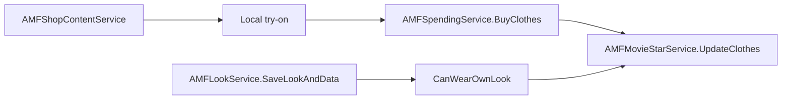

# II.2 — Clothes, Looks & Shop

> **EN** · [Français](../fr/06-clothes-looks-shopping.md)

## Architecture

## AMF services

| Service | Namespace | Role |
|---------|-----------|------|
| ShopContent | Shopping.AMFShopContentService | Catalogue (browse only) |
| Spending | Spending.AMFSpendingService | SC/diamond purchases |
| MovieStar | MovieStar.AMFMovieStarService | Wardrobe, UpdateClothes |
| Look | Looks.AMFLookService | Saved outfits |
| Actor | AMFActorService / ForWeb | Login, BuyClothesNew mobile, recolor |

## Flow — Buy clothes

1. Browse via `GetClothesByCategory`, `GetClothesSearch`, `GetClothesHighscore`…
2. Client checks VIP (`Cloth.Vip == 2`) and balances locally
3. `BuyClothes(actorId, ActorClothesRel2[], lookId)` — lookId ≠ 0 if buying from a look
4. Codes: 0 OK, −2 diamonds, −4 SC, −5 design creator
5. Success → auto-equip (`MY_SAVE_CLOTH`) → `UpdateClothes`

**No rate limit** on BuyClothes.

## Flow — Wear / save outfit

1. Dressing room equips clothes locally
2. `UpdateClothes(actorId, actorClothesRelIds[])`
3. Avatar snapshot via `CreateSnapshotSmallAndBig`

## Flow — Look

1. Capture snapshots + clothIds
2. `SaveLookAndData(look, clotheIds, snapshot, fullSnapshot)` → lookId + fame
3. Wear: `CanWearOwnLook` → if OK → UpdateClothes
4. Lists: GetLooksTopAll, GetLooksForActor, GetLooksLikedByMe…

Browser pagination: **10/page**. No rate limit on looks.

## Shop constants

| View | Page size |
|-----|-----------|
| Top/New/Friends | 10 |
| Categories | 12 |
| Designs | 7 |
| Themes | 8 |

Purchase fame: **5%** (`FAME_PERCENTAGE = 0.05`). Discounts: ShoppingSpree −50%, active theme.

## Detailed endpoints

→ [amf/03-avatar.md](amf/03-avatar.md) · [amf/04-looks.md](amf/04-looks.md) · [amf/05-shop.md](amf/05-shop.md)
