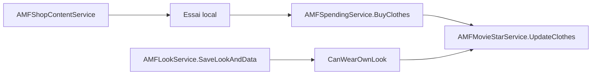

# II.2 — Vêtements, Looks & Boutique

> **FR** · [English](../en/06-clothes-looks-shopping.md)

## Architecture

## Services AMF

| Service | Namespace | Rôle |
|---------|-----------|------|
| ShopContent | Shopping.AMFShopContentService | Catalogue (browse only) |
| Spending | Spending.AMFSpendingService | Achats SC/diamants |
| MovieStar | MovieStar.AMFMovieStarService | Garde-robe, UpdateClothes |
| Look | Looks.AMFLookService | Tenues sauvegardées |
| Actor | AMFActorService / ForWeb | Login, BuyClothesNew mobile, recolor |

## Flux — Acheter un vêtement

1. Browse via `GetClothesByCategory`, `GetClothesSearch`, `GetClothesHighscore`…
2. Client vérifie VIP (`Cloth.Vip == 2`) et soldes localement
3. `BuyClothes(actorId, ActorClothesRel2[], lookId)` — lookId ≠ 0 si achat depuis look
4. Codes : 0 OK, −2 diamants, −4 SC, −5 créateur design
5. Succès → auto-équipe (`MY_SAVE_CLOTH`) → `UpdateClothes`

**Pas de rate limit** sur BuyClothes.

## Flux — Porter / sauver tenue

1. Dressing room équipe vêtements localement
2. `UpdateClothes(actorId, actorClothesRelIds[])`
3. Snapshot avatar via `CreateSnapshotSmallAndBig`

## Flux — Look

1. Capture snapshots + clothIds
2. `SaveLookAndData(look, clotheIds, snapshot, fullSnapshot)` → lookId + fame
3. Porter : `CanWearOwnLook` → si OK → UpdateClothes
4. Listes : GetLooksTopAll, GetLooksForActor, GetLooksLikedByMe…

Pagination browser : **10/page**. Pas de rate limit looks.

## Constantes shop

| Vue | Page size |
|-----|-----------|
| Top/New/Friends | 10 |
| Catégories | 12 |
| Designs | 7 |
| Themes | 8 |

Fame achat : **5%** (`FAME_PERCENTAGE = 0.05`). Réductions : ShoppingSpree −50%, thème actif.

## Endpoints détaillés

→ [amf/03-avatar.md](amf/03-avatar.md) · [amf/04-looks.md](amf/04-looks.md) · [amf/05-shop.md](amf/05-shop.md)
